<!-- TOC depthFrom:1 depthTo:6 withLinks:1 updateOnSave:1 orderedList:0 -->

- [第3章-内核编程语言和环境](#第3章-内核编程语言和环境)
	- [总结](#总结)
		- [as86汇编器](#as86汇编器)
		- [GNU as汇编](#gnu-as汇编)
		- [C语言程序](#c语言程序)
		- [C与汇编程序的互相调用](#c与汇编程序的互相调用)
		- [Linux 0.12 目标文件格式](#linux-012-目标文件格式)
		- [Make程序和Makefile文件](#make程序和makefile文件)

<!-- /TOC -->
# 第3章-内核编程语言和环境

## 总结

### as86汇编器
* as86虽然可以编译16位和32位程序，但是Linux仅用它来编译boot/bootsect.s和boot/setup.s。主要是因为其16位支持特色。其实完全可以用as代替，没问题的。作者也就想让你了解一下as86这么个玩意儿，虽然古董，但是有用。毕竟曾经在MINIX上风靡一时。
* as86采用Intel汇编
* Bruce Evans是MINIX操作系统32位版本的主要修改编制者之一。Linus很敬佩他，狗腿子一个，称他“Bruce is my hero!”。Linus从Bruce学到了很多东西，基本没有他教Linus，就没有Linux了。包括很多对于MINIX的缺点都是两个人讨论出来的，也正是两个人的探讨，嫌弃MINIX的一些缺点才让Linus萌生编写OS的念头。。。这，不知道Bruce有莫有后悔？~
* 汇编器编译产生的目标文件至少包括3个段或区segment or section
  - 正文段：代码段，包括**代码**和**只读数据**
  - 数据段：可读写数据且**已经初始化**
  - 未初始化数据段：**目标文件没有为该段保留空间**，但是链接的时候会把该段内容填充0
* 伪操作符=汇编伪指令=汇编指示符
  - 例如 .global begtext,begdata,begbss
* 一个汇编源文件主要包括辣么几部分，赋值语句+伪操作符语句+机器指令语句
  - 赋值语句=定义一个符号常量
  - 伪操作符语句=指示符+0个或多个操作数，不会产生机器码，仅作用于汇编阶段指示汇编器动作
  - 机器指令语句=机器指令的助记符=操作码+0个或多个操作数
* 以!或;开始的语句其后面均为注释

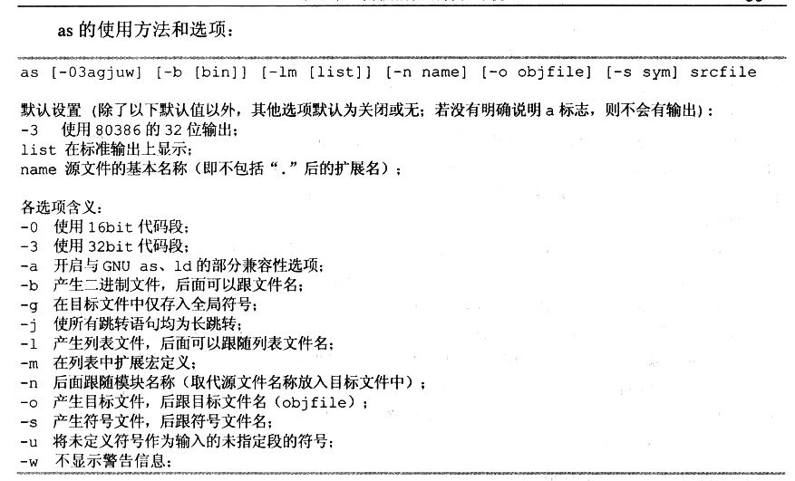

* 命令不用死记硬背，用到了再查。

### GNU as汇编

* GNU as最初模仿BSD 4.2的汇编器进行开发，说明BSD还是很屌的
* AT&T 和 Intel汇编的区别

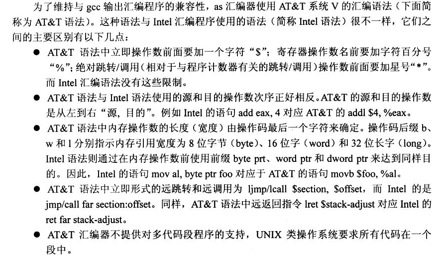

* as汇编器具备预处理功能
  - 删除多余空格字符和制表符
  - 删除所有注释符
  - 字符常量转换成对应的数字
* 但是as没有包含对宏定义的处理，也没用文件包含的功能。这些功能也就gcc在用，可以改变文件后缀为.S，让as使用GCC的CPP预处理功能。
* as还把#开头的行内容当做行注释，如果编译期间不进行预处理，那么头文件包含#include就会被过滤掉
* 文件最后语句必须有换行符
* 不允许使用数字开头命名符号
* 反斜杠 \ 可以拼接多行
* 字符串必须双引号，字符必须单引号

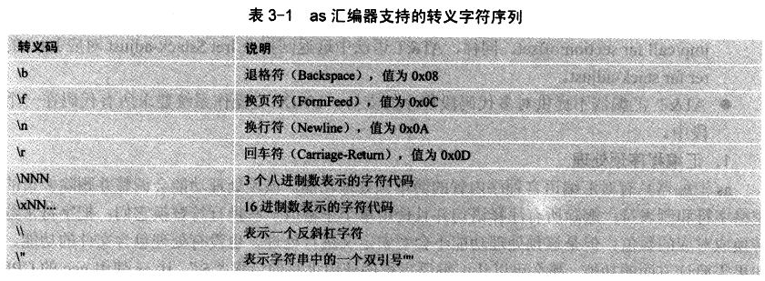

* 整数
  - 十六进制 0x 或 0X开头
  - 二进制 0B或0b开头
  - 八进制 0开头
  - 负数前进加 - 即可
* 重定位至关重要，必须掌握
* 绝对地址区，在重定位时候特例，不管怎样。老子就是要占据那个地址。这就是绝对地址区的特权，因此很容易重复地址而覆盖
* 未定义区域 - 汇编的时候不能确定坐在区域

### C语言程序

### C与汇编程序的互相调用

### Linux 0.12 目标文件格式

* 编译器用于对程序进行编译产生二进制代码和数据目标文件，链接器则用于对相关的所有目标文件进行组合处理，形成一个可被内核加载执行的目标文件
* as86和ld86是MINIX专用的目标文件格式

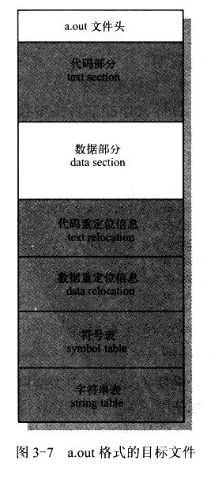

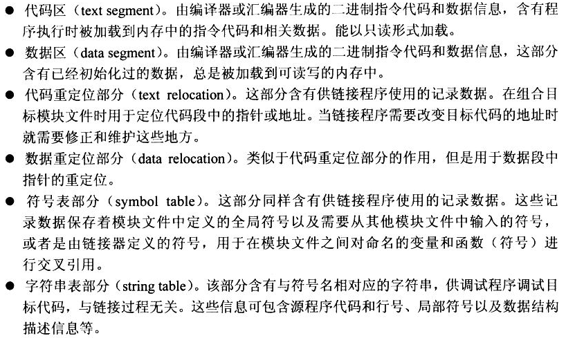

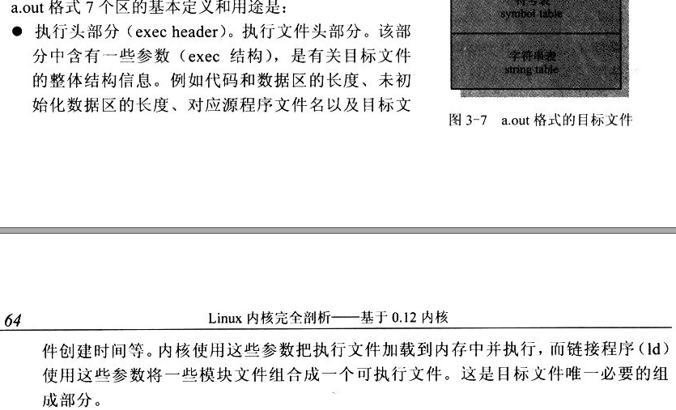

* 只有固定了格式才能解析，并且兼容性可移植性等等。说白了，你懂套路就能解析，不懂拉倒。
* 基本只有模块文件也就是目标文件包含重定位信息，可执行文件相关字段a_trsize和a_drsize都为0。

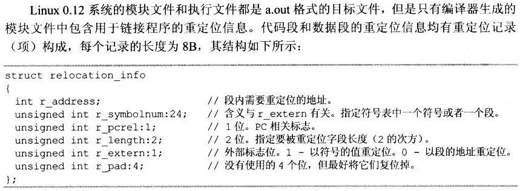

* 强调一下，重定位信息只供链接器使用。每一条重定位信息都有专门的格式，如上图所示。

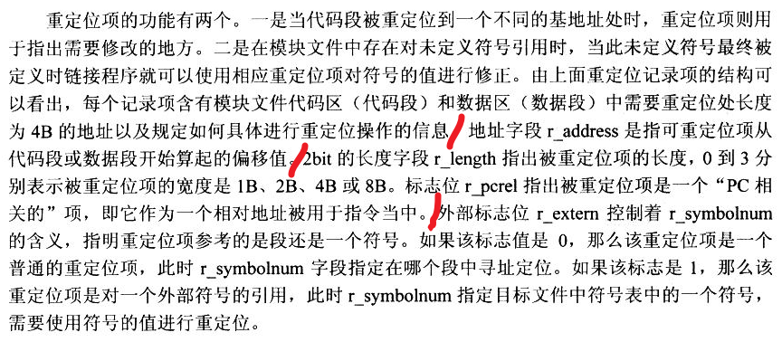

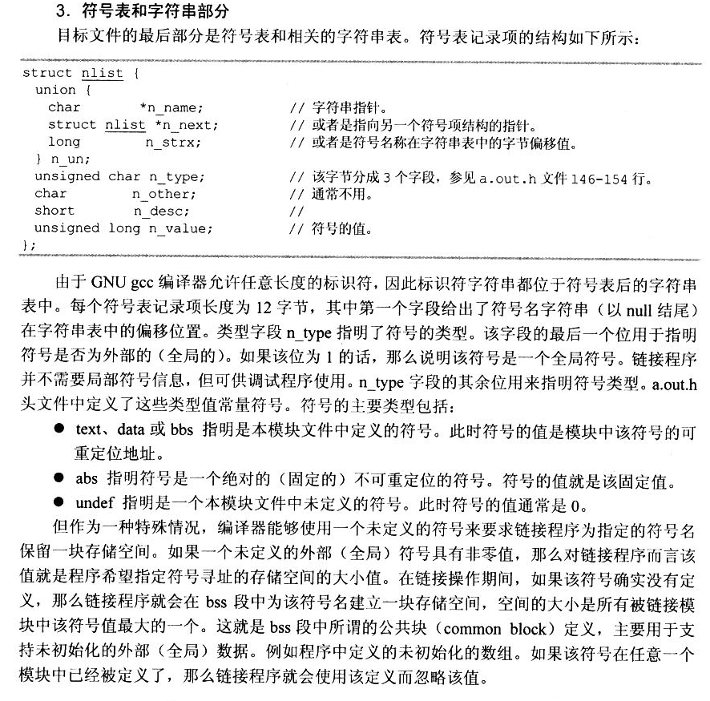

* strip命令可以剥离符号表信息，其实吧，符号信息就是某个地址对应了那个标号。这个，很容易知道哪个变量，哪个函数的地址了。逆向的时候求之不得，逆向难点就在于，搞不清楚起点终点，变量是啥，什么用。
* C语言说白了就是一堆函数围绕一堆杂七杂八数据进行操作的过程。突然想到《105个男人与三个女人的故事》。如果你能搞清楚具体的变量和具体的操作是什么意思，从哪个地址开始的。。那么逆向还难个锤子四不四~

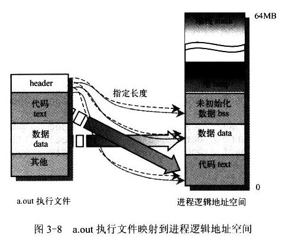

* Linux 0.12中进程的逻辑地址空间大小为64MB。进程在逻辑地址空间从0地址处开始，区别于现代系统0x0804,8000开始

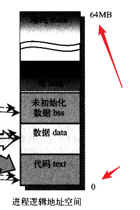

### Make程序和Makefile文件

* 伪目标-并没有实际目标存在，只是要骗make去执行一条shell命令
* 默认情况执行第一条规则

* Makefile还有很对规则书上没有提到，具体参看本章节目录下《GNU Make 使用手册》中文版pdf手册

