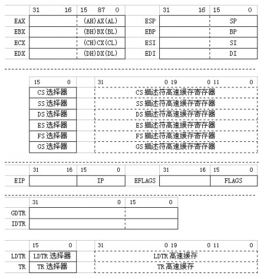
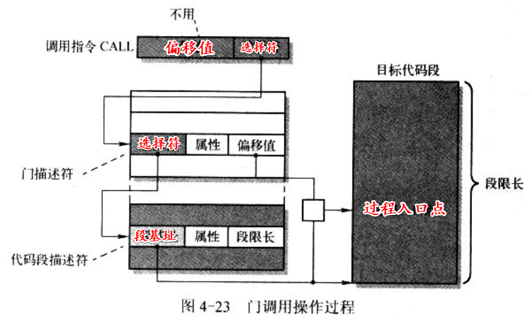
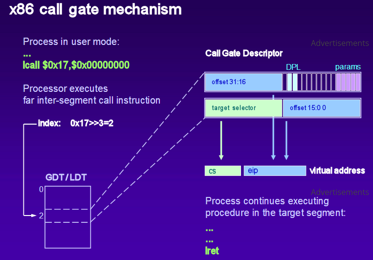

<!-- TOC depthFrom:1 depthTo:6 withLinks:1 updateOnSave:1 orderedList:0 -->

- [第4章-80x86保护模式及其编程](#第4章-80x86保护模式及其编程)
	- [总结](#总结)
	- [80x86系统寄存器和系统指令](#80x86系统寄存器和系统指令)
	- [保护模式内存管理](#保护模式内存管理)
	- [分段机制](#分段机制)
	- [分页机制](#分页机制)
	- [保护](#保护)
	- [当前特权级CPL](#当前特权级cpl)
		- [任务门](#任务门)
		- [中断门](#中断门)
		- [陷阱门](#陷阱门)
		- [调用门](#调用门)
		- [任务门+中断门+陷阱门+调用门比较](#任务门中断门陷阱门调用门比较)
	- [中断和异常处理](#中断和异常处理)
	- [任务管理](#任务管理)
	- [保护模式编程初始化](#保护模式编程初始化)
	- [END](#end)

<!-- /TOC -->
# 第4章-80x86保护模式及其编程

## 总结

* 这章节提到的内容非常重要，非常有用。虽然有些机制Linux内核并没有用到，但是了解体系结构必须的。
* 这章写的真特么经典，必须赞一波~

## 80x86系统寄存器和系统指令

## 保护模式内存管理

## 分段机制

## 分页机制

## 保护

## 当前特权级CPL

### 任务门

### 中断门

### 陷阱门

### 调用门

### 任务门+中断门+陷阱门+调用门比较

* 在x86种有四种门：中断门、陷阱门、调用门、任务门,这些是**CPU从硬件层**提供的支持。
*
* 任务门和其他三种门相比，在任务门中不需要用段内位移，因为任务门不指向某一个子程序的入口，TSS本身是作为一个段来对待的，而中断门、陷阱门和调用门则都要指向一个子程序，所以必须结合使用段选择码和段内位移。此外，任务门中相对于D标志位的位置永远是0.

* 中断门和陷阱门在使用上的区别不在于中断是外部产生的还是有CPU本身产生的，而在于通过中断门进入中断服务程序时CPU会自动将中断关闭（将EFLAGS寄存器中IF标志位置0），以防止嵌套中断产生，而通过陷阱门进入服务程序时则维持IF标志位不变。这是二者唯一的区别。

## 中断和异常处理

##任务管理

## 保护模式编程初始化

## END
