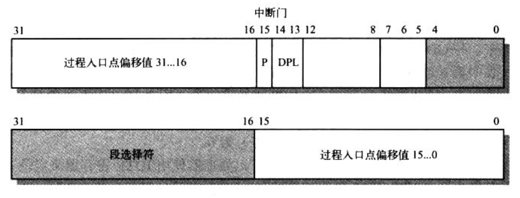
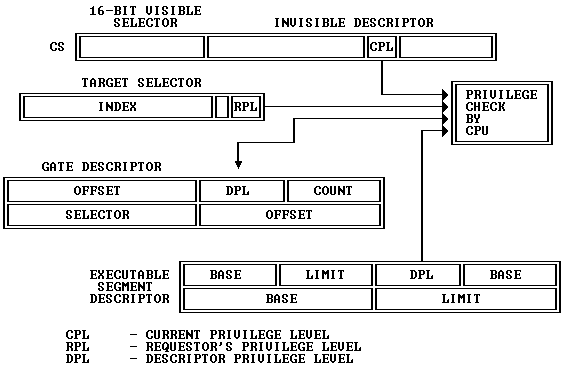
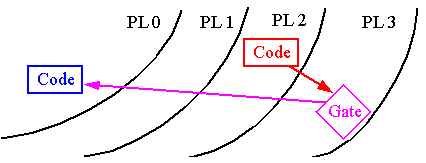

<!-- TOC depthFrom:1 depthTo:6 withLinks:1 updateOnSave:1 orderedList:0 -->

- [第4章-80x86保护模式及其编程](#第4章-80x86保护模式及其编程)
	- [总结](#总结)
	- [80x86系统寄存器和系统指令](#80x86系统寄存器和系统指令)
	- [保护模式内存管理](#保护模式内存管理)
	- [分段机制](#分段机制)
	- [分页机制](#分页机制)
	- [保护](#保护)
	- [当前特权级CPL](#当前特权级cpl)
		- [任务门](#任务门)
		- [中断门](#中断门)
		- [陷阱门](#陷阱门)
		- [调用门](#调用门)
		- [任务门+中断门+陷阱门+调用门比较](#任务门中断门陷阱门调用门比较)
	- [中断和异常处理](#中断和异常处理)
	- [任务管理](#任务管理)
	- [保护模式编程初始化](#保护模式编程初始化)
	- [参考](#参考)

<!-- /TOC -->
# 第4章-80x86保护模式及其编程

## 总结

* 这章节提到的内容非常重要，非常有用。虽然有些机制Linux内核并没有用到，但是了解体系结构必须的。
* 这章写的真特么经典，必须赞一波~
* 现代操作系统，都是运行处于保护模式的CPU之上的。所以，掌握好保护模式，才能学好操作系统。
* 段机制和页机制是保护模式的基础，也是实现现代操作系统的基础。只有深刻掌握和理解 CPU 的段页机制，你才能掌握操作系统底层的一些原理。
* 需要注意的是，**段机制和页机制是 CPU 这个硬件提供的功能，并不是操作系统提供的**。操作系统只是利用了 CPU 的这个功能。如果你不学习 CPU 提供的功能，你如何去理解操作系统如何去使用这种功能的呢？

## 80x86系统寄存器和系统指令

## 保护模式内存管理

## 分段机制

## 分页机制

## 保护

## 当前特权级CPL

### 任务门

### 中断门

### 陷阱门

### 调用门

### 任务门+中断门+陷阱门+调用门比较

* 在x86种有四种门：中断门、陷阱门、调用门、任务门,这些是**CPU从硬件层**提供的支持。
* 中断描述符IDT表示一个系统表，它与中断或异常向量相联系。每一个中断或异常向量在这个系统表中有对应的中断或异常处理程序入口地址。中断描述符的每一项对应一个中断或异常向量，每个向量由8个字节组成。因此，最多需要256*8=2048字节来存放IDT。
* 在运行中断之前，必须初始化IDT（中断描述符表）。
* IDT包含三种类型的中断描述符：**任务门、中断门、陷阱门**。描述符的第40~43位用于区分不同的描述符（每个描述符有8个字节/64bit）。
* 任务门和其他三种门相比，在任务门中不需要用段内位移，因为任务门不指向某一个子程序的入口，TSS本身是作为一个段来对待的，而中断门、陷阱门和调用门则都要指向一个子程序，所以必须结合使用段选择码和段内位移。此外，任务门中相对于D标志位的位置永远是0.

* 中断门和陷阱门在使用上的区别不在于中断是外部产生的还是有CPU本身产生的，而在于通过中断门进入中断服务程序时CPU会自动将中断关闭（将EFLAGS寄存器中IF标志位置0），以防止嵌套中断产生，而通过陷阱门进入服务程序时则维持IF标志位不变。这是二者唯一的区别。
* **调用门是安装在GDT表中的**，但是中断门并不是，它是安装在一个被称作IDT（中断描述符表）中的，它同 GDT 一样，每个元素占 8 个字节。
* 和调用门稍稍有点不一样的地方是，中断门提权会在堆栈中多压入一个值——EFLAGS。
* IDT表中各种类型的门，都可以通过 int [index] 汇编指令进入。有一点需要说明的是，使用 int 指令进入中断门，会影响栈。如果从 3 环进入 0 环，有两件事情要做。这些值都是被 CPU 自动保存起来的，和操作系统没有任何关系，这是 CPU 本身固有的特性。
	* 切换成 0 环栈
	* 在 0 环栈压入 ss3, esp3, eflags3, cs3, eip3( ss3 等后面的 3 表示的是 3 环下的栈，栈顶指针，eflags, 3环代码段选择子和返回地址。)
* 很少有使用中断门从 3 环进入 3 环的，这种设计感觉有点傻。
* 将真正的实现提权——当前特权级从3变为0。当然，CPU 不会让你就这么简单的从3环跨到0环。但是，CPU又必须提供一套方法，来让你完成这个功能。
* DPL = 0 的非一致代码段，是绝对不允许不同特权级的程序跳转进来。可是，我给以给你开个后门，让你进来，然后给你最高权限，允许你胡作非为。这个后门，必须由我（操作系统）来指定，而且只允许你跳转到我指定的地方。
* 所谓的后门，其实有很多，比如中断门，陷阱门，任务门。它们都可以实现提权。

## 中断和异常处理

##任务管理

## 保护模式编程初始化

## 参考

* CSDN博客 - OS 学习笔记导航 - <https://blog.csdn.net/q1007729991/article/details/52538571>
