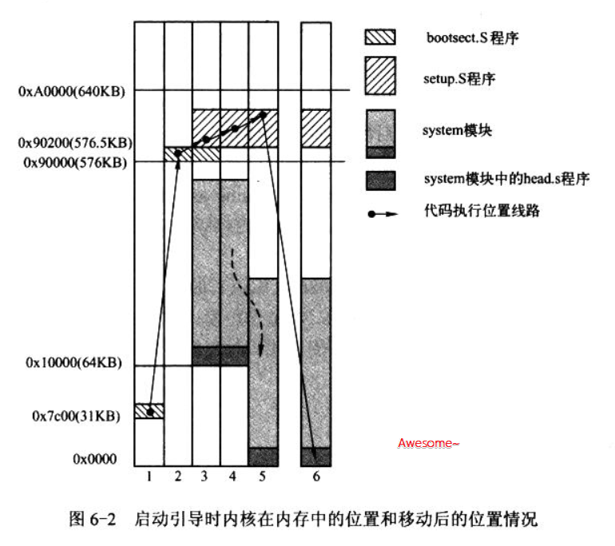
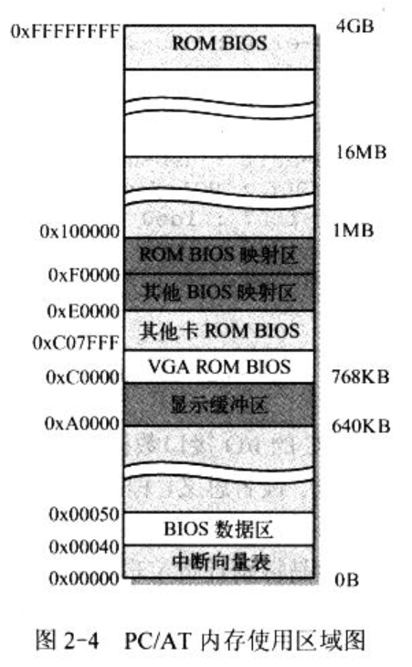
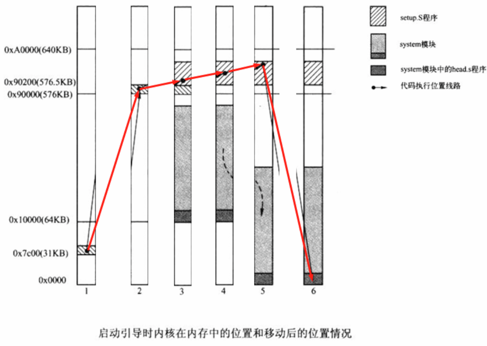
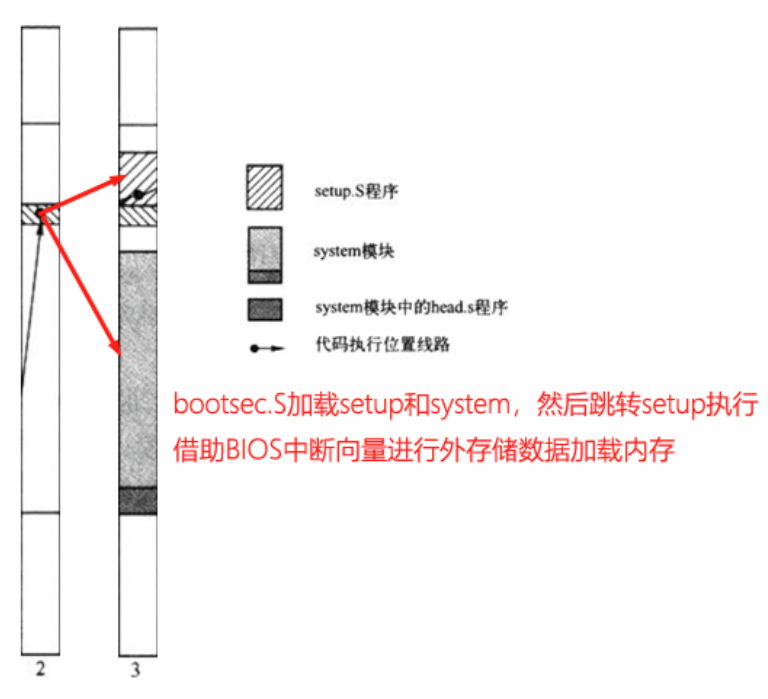
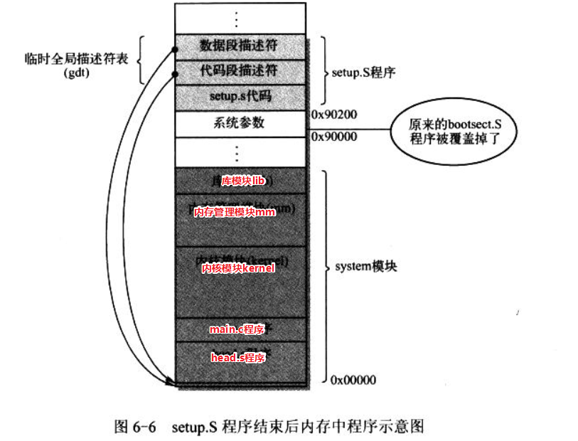
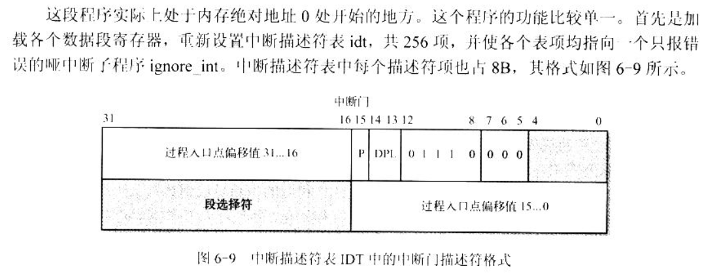
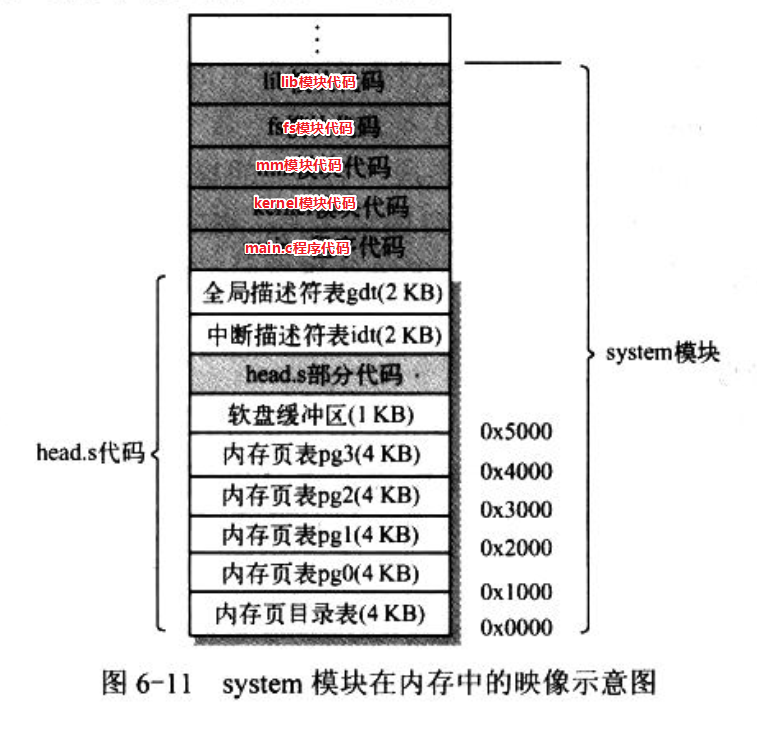

<!-- TOC depthFrom:1 depthTo:6 withLinks:1 updateOnSave:1 orderedList:0 -->

- [第6章-引导启动程序](#第6章-引导启动程序)
	- [总结](#总结)
		- [总体功能](#总体功能)
		- [setup.S程序](#setups程序)
		- [head.s程序](#heads程序)

<!-- /TOC -->
# 第6章-引导启动程序

## 总结

### 总体功能

* 为嘛要用ld86和as86然后再用GNU as和 GNU ld，因为当时GNU相关的工具不支持运行于16位代码程序。没有考虑过这个需求，所以Linus使用了两套工具。
* 这里再一次体现了Linus对GNU工具的依赖，所以当之无愧应该叫GNU/Linux
* 知道1994年GNU as才开始支持16位代码专用伪指令.code16
* 直到2.4内核才统一使用as来编写启动代码

这图画的真棒~

* 从0x7c00到0x000A,0000都是可以直接使用，不在BIOS部署的特定地址用途地址空间。**640KB-50B**

* system不是由setup.S加载，也是由bootsec.S加载。

### setup.S程序

* CPU在进入保护模式之前需要设定IDT表，因此在setup.S设定了一个长度为0的空表。

* 原来的启动扇区加载的地方用来存放使用BIOS中断获取到的参数

### head.s程序

